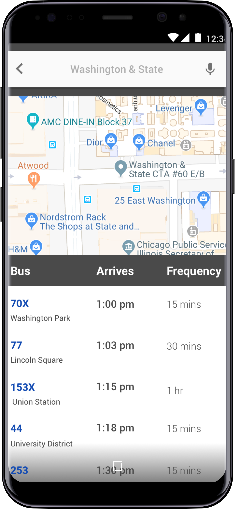

**BusyBus** is a public transit app that helps users navigate and find information about bus arrival times. 

Washington faced issues communicating bus delays and route closures to bus riders. This design displays real-time updates of bus times with frequency of arrival times. This creates a more transparent and stress free commute for bus riders. Bus riders also found it confusing when multiple buses arrived at the same stop, BusyBus shows all of the bus routes arriving at a stop. 

It was designed in Sketch but is using responsive design to show bus arrival times in various screen sizes. 

This project uses CSS & HTML. 

